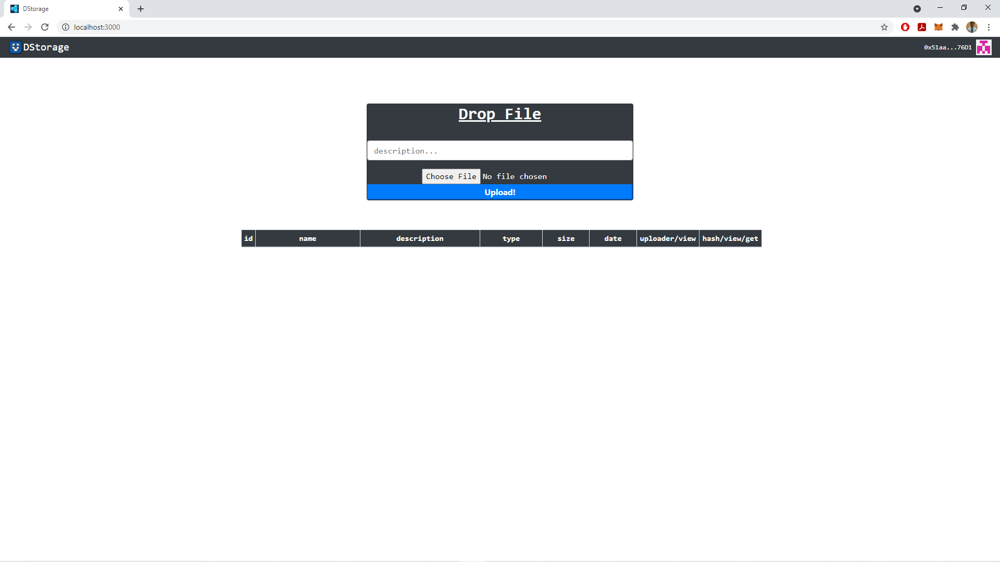
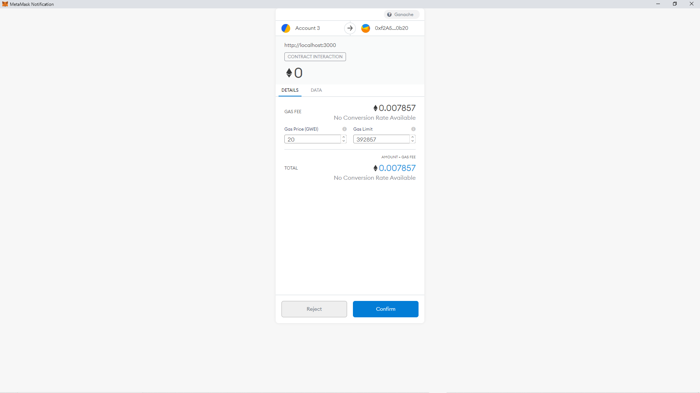
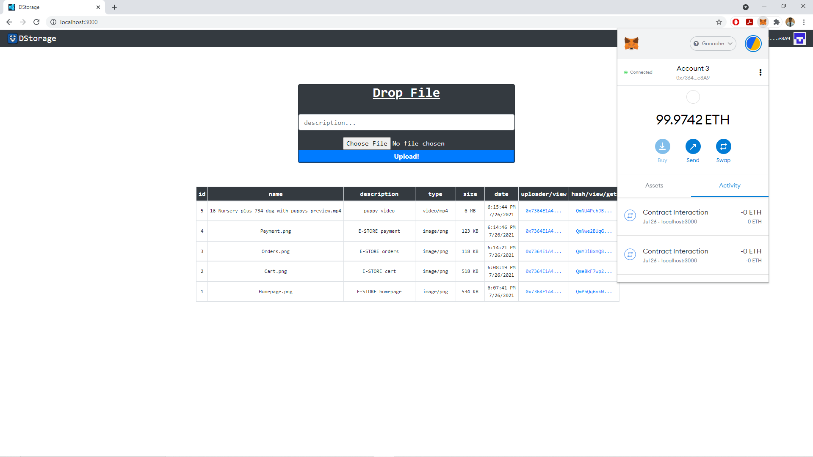
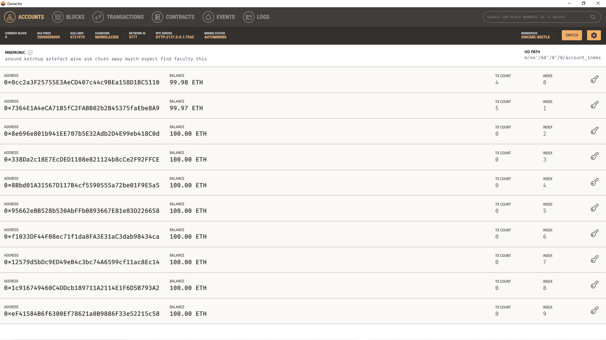

•	A decentralized storage and sharing web application.

•	The user can upload data and then can view or download them at any time later.

•	Smart contracts are deployed to blockchain to protect data.

•	Tools and Technology Used: Ganache, Truffle Suite, Solidity, MetaMask, React JS, Visual Studio Code.

Screenshots

